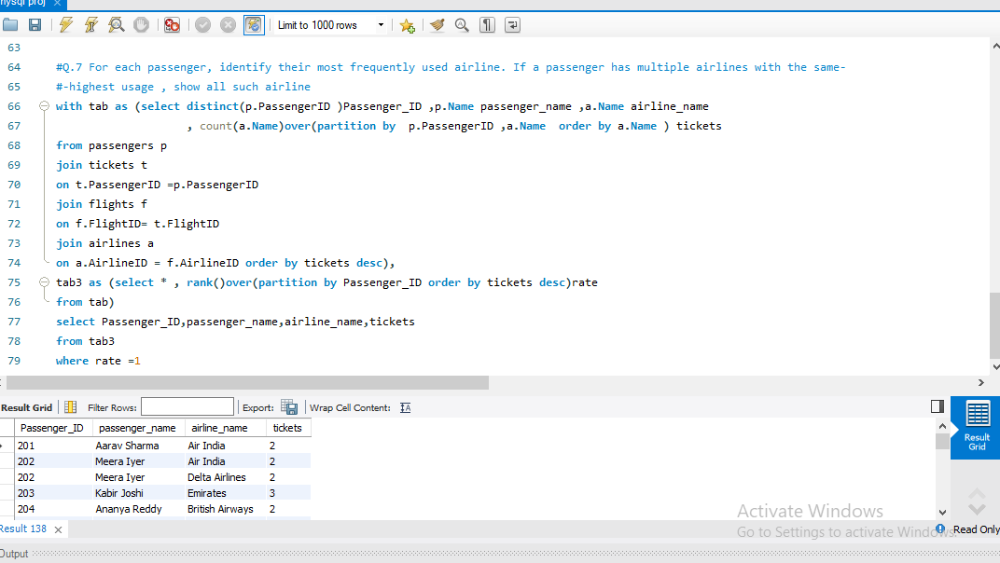
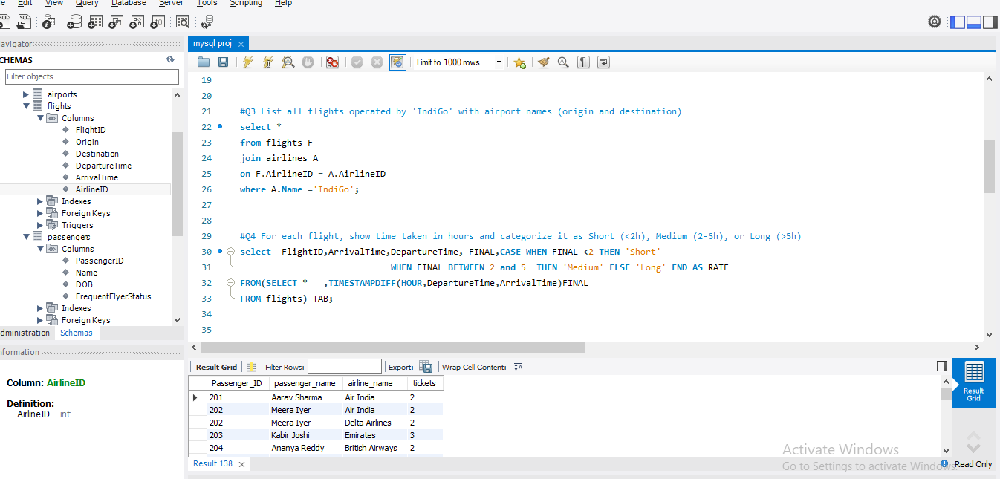

# Airline Data Analysis using SQL (MySQL)

This project contains SQL queries written in MySQL Workbench to analyze airline operations, passenger behavior, and revenue performance.

## 🔧 Tools Used
- MySQL Workbench
- SQL 

## 📊 Project Overview

This project answers real-world airline business questions such as:
- Identifying busiest airports
- Tracking airline ticket sales
- Calculating revenue and performance
- Analyzing passenger travel behavior
- Categorizing flight durations

## 🧠 SQL Concepts Used
- JOINs
- GROUP BY aggregation
- Window Functions (RANK, DENSE_RANK)
- CTEs (Common Table Expressions)
- Conditional Logic (CASE WHEN)
- Date/Time Functions (TIMESTAMPDIFF)

## 📌 Key Insights
- Airlines ranked by revenue
- Most active airports identified
- Passenger spending behavior analyzed
- Flight duration categorized into Short / Medium / Long

## 📁 Files
- airline_analysis.sql
- dataset 

## 🚀 Goal
To practice real-world SQL problem solving using airline dataset scenarios.
