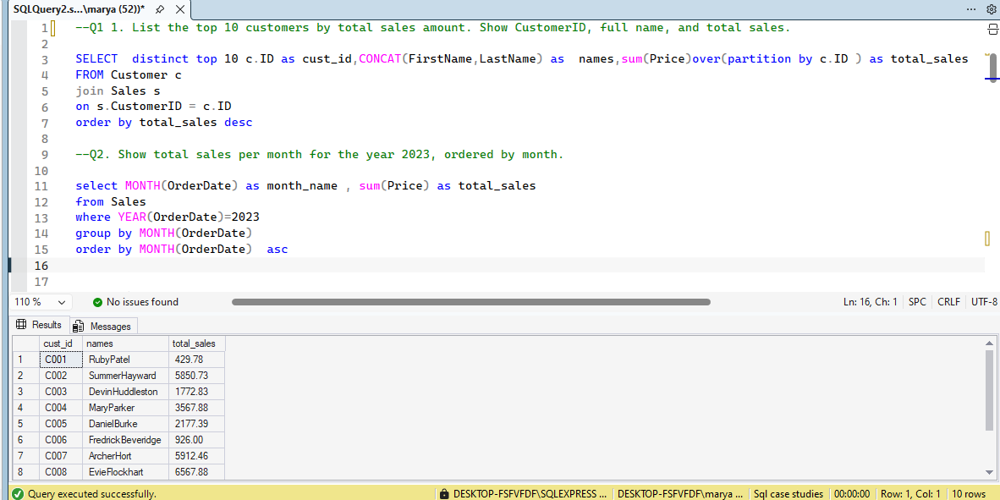
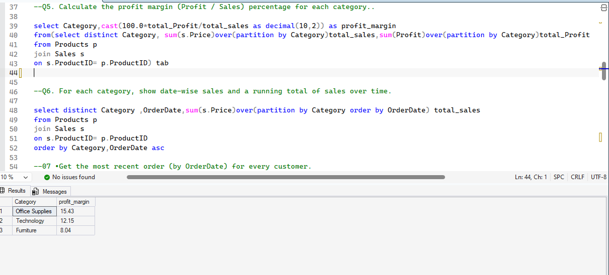
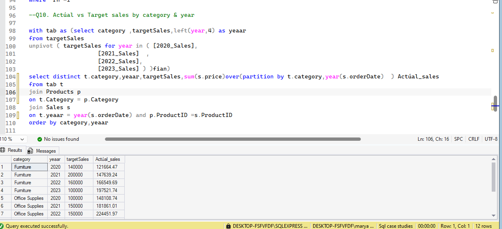

# Sales Analysis SQL Project

This project contains SQL queries for analyzing sales data using advanced SQL techniques.

## Tools Used
- SQL Server / MySQL
- SSMS 

## Key Topics Covered
- Window Functions
- CTEs
- Aggregations
- Ranking Functions
- Data Classification
- Time-based Analysis
- Target vs Actual Comparison

## Business Questions Answered
- Top customers by sales
- Monthly sales trends
- Product performance analysis
- Customer segmentation
- Category profitability
- Target vs actual performance

## Skills Demonstrated
- Analytical thinking
- Data transformation (UNPIVOT)
- Complex joins
- Business-oriented SQL queries

-.
-.
-.
